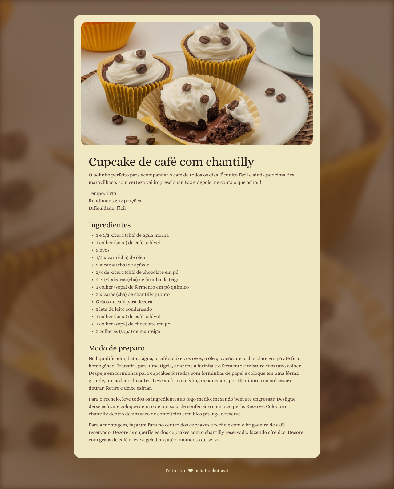

<h1 align="center"> Página de Receita </h1>

<a href="https://app.rocketseat.com.br/cart/rocketseat-one?referral=juan-almeida-1579997345&coupon=indicamgm&utm_source=platform&utm_medium=organic&utm_campaign=venda&utm_term=mgm&utm_content=indication-lp_one">Esse projeto foi desenvolvido no curso Full Stack da Rocketseat. Torne-se um aluno Rocket e embarque nessa jornada rumo ao sucesso!</a>

  <a href="#-visão-geral-do-projeto">Visão Geral do Projeto</a>&nbsp;&nbsp;&nbsp;|&nbsp;&nbsp;&nbsp;
  <a href="#-tecnologias-utilizadas">Tecnologias Utilizadas</a>&nbsp;&nbsp;&nbsp;|&nbsp;&nbsp;&nbsp;
  <a href="#-estrutura-do-projeto">Estrutura do Projeto</a>&nbsp;&nbsp;&nbsp;|&nbsp;&nbsp;&nbsp;
  <a href="#-como-vizualizar">Como Visualizar</a>&nbsp;&nbsp;&nbsp;
  

## 💻 Visão Geral do Projeto

A página apresenta uma receita detalhada de cupcakes de café com chantilly, incluindo a lista de ingredientes, o modo de preparo, o tempo de preparo, o rendimento e o nível de dificuldade.

## 🚀 Tecnologias Utilizadas

- HTML
- CSS

## 🏗️ Estrutura do Projeto

O projeto é composto pelos seguintes arquivos:

- `index.html`: Contém a estrutura HTML da página.
- `style.css`: Contém os estilos CSS para a página.
- `assets/`: Contém as imagens utilizadas na página.

## 👀 Como Visualizar

Para visualizar a página em seu navegador, siga estas etapas:

1. Faça o download ou clone este repositório.
2. Abra o arquivo `index.html` em um navegador web.
  
- Ou [Acesse o projeto finalizado, online.](https://juandasilvaa.github.io//)

